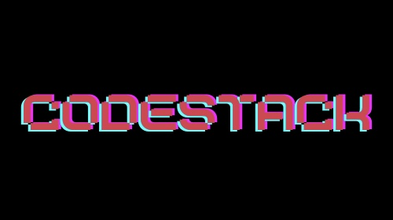

# CodeStack

### Date: 21 March 2021

#### Authors:

* Faryal Ansari:
[GitHub](https://github.com/f-ansari) | 
[LinkedIn](https://www.linkedin.com/in/faryal-a-43505b154/)
* Christina Padilla:
[GitHub](https://github.com/hipstina) | 
[LinkedIn](https://www.linkedin.com/in/hipstina/)
* Nick Williams:
[GitHub](https://github.com/NickWill24) | 
[LinkedIn](https://www.linkedin.com/in/nickwill24/)
* Luke Arenas:
[GitHub](https://github.com/LukeArenas) | 
[LinkedIn](https://www.linkedin.com/in/lukearenas/)

***

***
#### ***Description***
Code Stack is a fun and interactive educational tool that allows users to create their custom decks of flashcards. Each flashcard will enable the user to input the title, code block, and notes, as well as selecting the coding language being reviewed. In addition to their own sets, users will also be able to see and interact with decks that other users have created. Coding just got a whole lot easier.

### ***Technologies***

***

### ***Getting Started***

To get started, click [this link ](https://trello.com/b/vYAmm1du/project-3) to visit our trello board.

***

### ***Screenshots***

##### Add screenshots of your projects

***

### ***Future Updates***

- [ ] Have User like the decks
- [ ] Have User comment on each deck
- [ ] Have User get All decks
- [ ] Have a Feed with All other User deck
- [ ] Have comment page
- [ ] Have a friend page

### ***Credit***

* memes from: [google](https://google.com)

* [Markdown Cheasheet](https://guides.github.com/pdfs/markdown-cheatsheet-online.pdf)
* [Markdown guide](https://ia.net/writer/support/general/markdown-guide)
